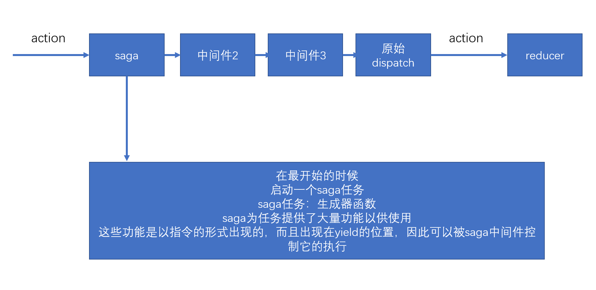

## redux-saga

> 中文文档地址：https://redux-saga-in-chinese.js.org/

- 纯净
- 强大
- 灵活



在saga任务中，如果yield了一个普通数据，saga不作任何处理，仅仅将数据传递给yield表达式（把得到的数据放到next的参数中），因此，在saga中，yield一个普通数据没什么意义。

saga需要你在yield后面放上一些合适的saga指令（saga effects），如果放的是指令，saga中间件会根据不同的指令进行特殊处理，以控制整个任务的流程。

每个指令本质上就是一个函数，该函数调用后，会返回一个指令对象，saga会接收到该指令对象，进行各种处理

**一旦saga任务完成（生成器函数运行完成），则saga中间件一定结束**

**指令前面必须使用yield，以确保该指令的返回结果被saga控制**

- take指令：【阻塞】监听某个action，如果action发生了，则会进行下一步处理，take指令仅监听一次。yield得到的是完整的action对象
- all指令：【阻塞】该函数传入一个数组，数组中放入生成器，saga会等待所有的生成器全部完成后才会进一步处理
- takeEvery指令：不断的监听某个action，当某个action到达之后，运行一个函数。takeEvery永远不会结束当前的生成器


- delay指令：【阻塞】阻塞指定的毫秒数

- put指令：用于重新触发action，相当于dispatch一个action

```js
import { takeEvery, delay, put } from "redux-saga/effects"
import { actionTypes, increase, decrease } from "../action/counter"

function* asyncIncrease() {
    yield delay(2000);
    yield put(increase())
}

function* asyncDecrease() {
    yield delay(2000);
    yield put(decrease())
}

export default function* () {
    yield takeEvery(actionTypes.asyncIncrease, asyncIncrease)
    yield takeEvery(actionTypes.asyncDecrease, asyncDecrease)
    console.log("正在监听asyncIncrease、asyncDecrease")
}
```

- call指令：【可能阻塞】用于副作用（通常是异步）函数调用
- apply指令：【可能阻塞】用于副作用（通常是异步）函数调用
```js
import { actionTypes, setIsLoading, setStudentsAndTotal } from "../action/student/searchResult"
import { takeEvery, put, call, select } from "redux-saga/effects"

/**
 * 回调模式的异步
 * @param {*} callback 
 */
function mockStudents(condition, callback) {
    console.log("mockStudents", condition);
    setTimeout(() => {
        if (Math.random() > 0.5) {
            //nodejs风格
            callback(null, {
                cont: 78,
                datas: [
                    { id: 1, name: "abc" },
                    { id: 2, name: "bcd" }
                ]
            })
        }
        else {
            callback(new Error("出错了！！！1"), null);
        }
    }, 3000);
}

function* fetchStudents() {
    //设置为正在加载中
    yield put(setIsLoading(true))
    const condition = yield select(state => state.students.condition);
    //使用call指令，按照当前仓库中的条件
    const resp = yield call(mockStudents, condition)
    yield put(setStudentsAndTotal(resp.datas, resp.cont))
    yield put(setIsLoading(false));
}

export default function* () {
    yield takeEvery(actionTypes.fetchStudents, fetchStudents);
    console.log("正在监听 fetchStudents")
}
```


- select指令：用于得到当前仓库中的数据
- cps指令：【可能阻塞】用于调用那些传统的回调方式的异步函数

```js
import { actionTypes, setIsLoading, setStudentsAndTotal } from "../action/student/searchResult"
import { takeEvery, put, cps, select } from "redux-saga/effects"

/**
 * 回调模式的异步
 * @param {*} callback 
 */
function mockStudents(condition, callback) {
    console.log("mockStudents", condition);
    setTimeout(() => {
        if (Math.random() > 0.5) {
            //nodejs风格
            callback(null, {
                cont: 78,
                datas: [
                    { id: 1, name: "abc" },
                    { id: 2, name: "bcd" }
                ]
            })
        }
        else {
            callback(new Error("出错了！！！1"), null);
        }
    }, 1000);
}

function* fetchStudents() {
    //设置为正在加载中
    yield put(setIsLoading(true))
    const condition = yield select(state => state.students.condition);
    //使用call指令，按照当前仓库中的条件
    try {
        const resp = yield cps(mockStudents, condition)
        yield put(setStudentsAndTotal(resp.datas, resp.cont))
    }
    catch (err) {
        console.log(err.message);
    }
    finally {
        yield put(setIsLoading(false));
    }
}

export default function* () {
    yield takeEvery(actionTypes.fetchStudents, fetchStudents);
    console.log("正在监听 fetchStudents")
}
```